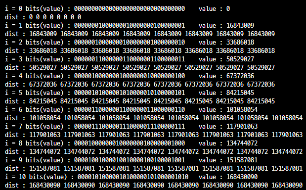

<h1 align = "center">백준 13549번 숨바꼭질3</h1>

### [문제 링크](https://www.acmicpc.net/problem/13549 "13549번 숨바꼭질3")
---

### 최초 코드

```cpp
//숨바꼭질 앞뒤로 한칸씩 움직이거나(1초 소모) 현재 좌표의 두배로 이동 할 수 있음(0초 소모)
//예전에 풀었던 문제처럼 BFS로 해결 가능할듯

#include<iostream>
#include<queue>
#include<algorithm>
#include<cstring>
using namespace std;

int N,M;
int vis[100001];
int result= 10000000;

void BFS(int n) {
	queue<pair<int, int>> q;//좌표 + 시간
	q.push({ n,0 });

	while (!q.empty()) {
		int x = q.front().first;
		int cnt = q.front().second;
		q.pop();

		if (x == M)
			result = min(result, cnt);
		//else if(result < cnt)continue;
		else {
			for (auto i = 0; i < 3; ++i) {
				int nx;
				if (i == 0)
					nx = x + 1;
				else if (i == 1)
					nx = x - 1;
				else if (i == 2)
					nx = x * 2;

				if (nx < 0 || nx >= 100001)continue;
				if (i == 2 && (vis[nx] > cnt || vis[nx] == -1)) {
					q.push({ nx,cnt });
					vis[nx] = cnt;//순간이동이니까 시간 경과X
				}
				else if (vis[nx] > cnt + 1 || vis[nx] == -1) {
					q.push({ nx,cnt+1 });
					vis[nx] = cnt + 1;
				}
			}
		}
	}
}

int main(void) {
	cin.tie(NULL)->sync_with_stdio(false);

	memset(vis, -1, sizeof(vis));//0초일수도 있으니까 -1로 초기화
	cin >> N >> M;
		
	BFS(N);
	cout << result;

	return 0;
}
```

### 복기
숨바꼭질 문제였는데 1과의 차이점은 순간이동이 있다는거였고 순간이동은 시간을 소모하지 않는다는거였다. 그래서 BFS를 돌리면서 탐색하는방법을 3가지(앞,뒤,순간이동)으로 잡고 탐색했고 순간이동을했을 경우는 방문은 했지만 카운트는 증가시키지 않는 방법을 사용했다. 처음 제출했을때 틀렸던 이유는
```cpp
if (x == M)
	result = min(result, cnt);
//else if(result < cnt)continue;

```
최솟값일때 저장하는 부분에서 처음에는 min함수를 사용하지 않고 if문으로 구현했다가 나중에 바꾸는과정에서 else if를 그대로 뒀기때문이다... 

>ctring의 memset이라는 함수는 주로 배열을 원하는 값으로 초기화하는데 사용한다. 
여태까지는 0,-1만 사용해서 이상한 점을 느끼지 못했었다. 
처음에 사용할때 당연히 algorithm에 있겠구나 하고 사용하다가 컴파일 오류가 나는 경우가 많아서 cstring에 있는것을 확실하게 알게 되었는데 알고보니 memset은 char형을 초기화하는 함수였고, 0,-1이 아닌 다른 값을 초기화 하게 되면 다른값이 들어간다.

```cpp
#include <iostream>
#include <cstring>
#include <bitset>

using std::cout;
using std::cin;
using std::bitset;

int dist[8]{};

void PrintDist() {
	cout << "dist : ";
	for (int& v : dist) cout << v << ' ';
	cout << '\n';
}

int main() {
	/*
	memset(dist, 0x00, sizeof(dist)); // 0
	PrintDist();
	memset(dist, 0x3f, sizeof(dist)); // 1061109567
	PrintDist();
	*/

	using bits = std::bitset<sizeof(int)*CHAR_BIT>; // 32bit
	// CHAR_BIT : 8
	// sizeof(int) : 4

	for (int i{}; i <= 0xff; ++i) {
		memset(dist, i, sizeof(dist));
		cout << "i = " << i << ' ';
		cout << "bits(value) : " << bits(dist[0]) << "\tvalue : " << dist[0] << '\n';
		PrintDist();
	}

	return 0;
}

```


출처: [memset | 작성자 초코브리즈](https://blog.naver.com/chocobreeze/223095589362)

<h1 align = "center">백준 14890번 경사로</h1>

### [문제 링크](https://www.acmicpc.net/problem/14890 "14890번 경사로")
---

### 최초 코드

```cpp
#include<iostream>
#include<queue>
#include<vector>
#include<cmath>
#include<algorithm>
using namespace std;

int N, L, result;
int Map1[101][101];
int Map2[101][101];

void Checkroad(int Map[][101]) {//가로방향으로 탐색
	for (auto i = 0; i < N; ++i) {
		bool check{ true };
		bool slope[101]{ 0 };

		for (auto j = 0; j < N-1; ++j) {//마지막길은 다음길이 없어서 안봄
			if (abs(Map[i][j] - Map[i][j+1]) > 1) {//높이차이가 1이상이면 이 줄 버리고 다음줄로
				check = false;
				break;
			}

			if (Map[i][j] - Map[i][j + 1] == 1) {//높은곳에서 낮은곳으로 경사 놓을때
				int height = Map[i][j + 1];
				for (auto h = j + 2; h < j + 1 + L; ++h) {//j+2번째 블록이 바로 높이가 다른 블록이거나 끝일 경우 break
					if (h >= N || Map[i][h] != height) {
						check = false;
						break;
					}
				}
				if (check) {
					slope[j + 1] = 1;//경사로 설치 체크
				}
				else
					break;
			}

			if (Map[i][j] - Map[i][j + 1] == -1) {//낮은곳에서 높은곳
				int height = Map[i][j];
				for (auto h = j; h > j - L; --h) {//왼쪽에서 오른쪽으로 간다는 조건에서 왼쪽이 끝을 넘거나 높이가 다른 땅일 경우
					if (h < 0 || Map[i][h] != height||slope[h]) {
						check = false;
						break;
					}
				}
				if (!check)
					break;
			}
		}
		if (check)
			result++;
	}
}

int main(void) {
	cin.tie(NULL)->sync_with_stdio(false);

	cin >> N >> L;
	for (auto i = 0; i < N; ++i) {
		for (auto j = 0; j < N; ++j) {
			cin >> Map1[i][j];
			Map2[j][i] = Map1[i][j];
		}
	}

	Checkroad(Map1);
	Checkroad(Map2);
			
	cout << result << '\n';
	return 0;
}
```

### 복기
경사로의 높이가1이고 길이가 L일때 경사로를 놓고 길이 이어지거나 그냥 평평해서 이어지는 길을 세서 출력하는 문제였다. 생각을 아주 조금 잘못했던것+실수로 틀린부분을 찾는데 1시간 이상 사용했다.
실수: for문을 적을때 변수명을 i,j,h이런식으로 정하니까 작성하면서 모양도 비슷하고 한글자이다보니 실수를 자꾸 하게된다 앞으로는 귀찮더라도 dir row col 이런식으로잡는 버릇을 들여야겠다.

잘못생각한 점: 

```cpp
if (check) {
	slope[j + 1] = 1;//경사로 설치 체크
}
```
```cpp
if (check) {
	for (auto l = 1; l <= L; ++l) {
		slope[j + l] = 1;//경사로 설치 체크
	}
}
```
경사로를 놓는다 라는 것을 체크할때 처음에는 탐색을 했던 해당 좌표에만 체크를 한다라는 생각을 했는데 다시 생각해보니 경사로가 놓여져있는 모든 바닥은 어떻게해서라도 설치하면 안되기때문에 바닥을 전부 체크로 바꿔주면 다음 탐색에서 안겹칠수 있었다.
문제의 두번째 TC에서 디버그를 돌려본 결과 방향이 다른 발판을 중복으로 놓는것을 확인하고 고칠 수 있었다.
복기를 하면서 생각해보니 경사로의 끝지점만 체크를 해주면 길이만큼 안하더라고 확인이 가능할것 같긴했다.

#### 추가
함수에 배열을 전달할때 1차원 배열은 
```cpp
void Checkroad(int Map[])
```
이런식으로 넣는데
2차원 배열을 전달해본 적이 없어서 검색을 해봤다.
```cpp
void Checkroad(int Map[][101])
void Checkroad(int **Map)
```

[참고자료1](https://dojang.io/mod/page/view.php?id=1969)
[참고자료2](https://velog.io/@min_gi1123/c-2%EC%B0%A8%EC%9B%90-%EB%B0%B0%EC%97%B4%ED%8F%AC%EC%9D%B8%ED%84%B0-%EB%A7%A4%EA%B0%9C%EB%B3%80%EC%88%98%EB%A1%9C-%EB%84%98%EA%B8%B0%EA%B8%B0)
### 최종 코드
```cpp
//경사로를 놓고 갈 수 있거나 길의 높이가 같아 평평한 경우를 길로 카운트 한다.
//경사로는 높이가 1 차이나는 경우만 놓을 수 있고, 길이가  L이며, 겹칠 수 없음.
//탐색은 2N번 직선으로 하면되는데 어떻게 구현할지 고민해봐야함 (땅의 높이 차이가 1일때 같을때 2 이상일때)
//한 방향으로 한줄씩 탐색하는것을 두번 (맵을 2개로 만들어서 [i][j], [j][i] 로 만들면 하나의 탐색방법으로 두가지 다 볼 수 있음

#include<iostream>
#include<queue>
#include<vector>
#include<cmath>
#include<algorithm>
using namespace std;

int N, L, result;
int Map1[101][101];
int Map2[101][101];

void Checkroad(int Map[][101]) {//가로방향으로 탐색
	for (auto i = 0; i < N; ++i) {
		bool check{ true };
		bool slope[101]{ 0 };

		for (auto j = 0; j < N-1; ++j) {//마지막길은 다음길이 없어서 안봄
			if (abs(Map[i][j] - Map[i][j+1]) > 1) {//높이차이가 1이상이면 이 줄 버리고 다음줄로
				check = false;
				break;
			}

			if (Map[i][j] - Map[i][j + 1] == 1) {//높은곳에서 낮은곳으로 경사 놓을때
				int height = Map[i][j + 1];
				for (auto h = j + 2; h < j + 1 + L; ++h) {//j+2번째 블록이 바로 높이가 다른 블록이거나 끝일 경우 break
					if (h >= N || Map[i][h] != height) {
						check = false;
						break;
					}
				}
				if (check) {
					for (auto l = 1; l <= L; ++l) {
						slope[j + l] = 1;//경사로 설치 체크
					}
				}
				else
					break;
			}

			if (Map[i][j] - Map[i][j + 1] == -1) {//낮은곳에서 높은곳
				int height = Map[i][j];
				for (auto h = j; h > j - L; --h) {//왼쪽에서 오른쪽으로 간다는 조건에서 왼쪽이 끝을 넘거나 높이가 다른 땅일 경우
					if (h < 0 || Map[i][h] != height||slope[h]) {//이미 경사로를 놨을경우
						check = false;
						break;
					}
				}
				if (check)
					slope[j] = 1;
				else
					break;
			}
		}
		if (check)
			result++;
	}
}

int main(void) {
	cin.tie(NULL)->sync_with_stdio(false);

	cin >> N >> L;
	for (auto i = 0; i < N; ++i) {
		for (auto j = 0; j < N; ++j) {
			cin >> Map1[i][j];
			Map2[j][i] = Map1[i][j];
		}
	}

	Checkroad(Map1);
	Checkroad(Map2);
			
	cout << result << '\n';
	return 0;
}
```
