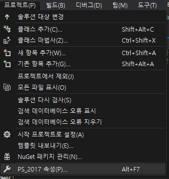
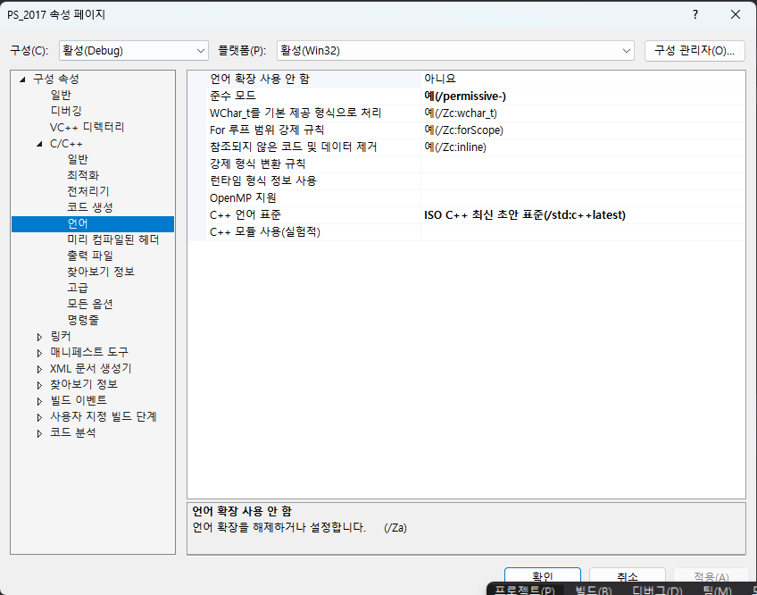

<h1 align = "center">삼성 SW역량테스트 23년 하반기 오후 1번 </h1>

### [문제 링크](https://www.codetree.ai/training-field/frequent-problems/problems/rudolph-rebellion/description?page=1&pageSize=20 "루돌프의 반란")
---

### 최초 코드

```cpp
//산타, 루돌프 움직임 구현 -> 산타는  상우하좌 순의 우선순위가 있으니 dx dy를 선언해서 BFS 돌리는 식으로 하고
// 루돌프는 산타들이랑 거리 계산해서 우선순위 제일 높은 산타랑 좌표 비교해서 각 x,y좌표를 가까워지는 쪽으로 계산하는 방식이 나을것 같다. 
// dx,dy 8방향 굳이 탐색 안해도 될듯 
//충돌 구현, 상호작용 구현 
//턴 지나가는거 카운트 
//기절, 아웃 고려

#include<iostream>
#include<queue>
using namespace std;

struct Player {
	int id;
	int r, c;
	bool active;
	int power;
	int score;
};

vector<Player> santa;

pair<int, int> rudolf;
int N, M, P, C, D;
int Map[51][51];
int stunned[31];

int dx[] = { -1,0,1,0 }; //상 우 하 좌
int dy[] = { 0,1,0,-1 };
bool is_inside(int x, int y) { return x >= 0 && x < N&& y >= 0 && y < N; } //맵 안에 들어와있는지 나타내는 함수


int main(void) {
	cin.tie(NULL)->sync_with_stdio(false);

	cin >> N >> M >> P >> C >> D;

	cin >> rudolf.first >> rudolf.second;
	Map[rudolf.first][rudolf.second] = -1;

	vector<Player> santa(P+1);
	for (auto i = 1; i <= P; ++i) {
		cin >> santa[i].id >> santa[i].r >> santa[i].c;
		santa[i].active = 1;
		santa[i].power = D;
		santa[i].score = 0;
		Map[santa[i].r][santa[i].c] = santa[i].id;
	}

	//루돌프부터 이동
	int turn = M;
	while (--M) {
		int nearX = 10000;
		int nearY = 10000;
		int nearid = 0;
		pair<int, pair<int, int>> curlength = { (nearX - rudolf.first) * (nearX - rudolf.first) + (nearY - rudolf.second) * (nearY - rudolf.second) ,{nearX,nearY} };

		for (auto i = 0; i <= P; ++i) {
			if (santa[i].active) continue;//살아있는지
			pair<int, pair<int, int>> curlength = { (nearX - rudolf.first) * (nearX - rudolf.first) + (nearY - rudolf.second) * (nearY - rudolf.second) ,{nearX,nearY} };
			pair<int, pair<int, int>> tmplength = { (santa[i].r - rudolf.first) * (santa[i].r - rudolf.first) + (santa[i].c - rudolf.second) * (santa[i].c - rudolf.second),{santa[i].r,santa[i].c} };
			if (tmplength.first < curlength.first) {
				nearX = tmplength.second.first;
				nearY = tmplength.second.second;
				nearid = i;
			}
			else if (tmplength == curlength) { // 거리가 같으면 x좌표가 더 큰 산타로 목표를 잡기위해 좌표도 같이 저장
				if (tmplength.second.first > curlength.second.first) {
					nearX = tmplength.second.first;
					nearY = tmplength.second.second;
					nearid = i;
				}
				else if (tmplength.second.first == curlength.second.first) {
					if (tmplength.second.second > curlength.second.second) {
						nearX = tmplength.second.first;
						nearY = tmplength.second.second;
						nearid = i;
					}
				}
			}
		}

		if (nearid != 0) {
			int rx=0,ry=0;
			if (rudolf.first < nearX) rx = 1;
			else if (rudolf.first > nearX) rx = -1;

			if (rudolf.second < nearY) ry = 1;
			else if(rudolf.second > nearY) ry = -1;

			Map[rudolf.first][rudolf.second] = 0;
			rudolf.first += rx;
			rudolf.second += ry;

			//충돌하면 C만큼의 파워로 해당 산타 밀어버리기 ->nearid에 저장된 인덱스를 가지는 산타
			if (rudolf.first == santa[nearid].r && rudolf.second == santa[nearid].c) {
				stunned[nearid] = turn - M + 1; //현재라운드 +1에 못움직이니까

				int crashedX = santa[nearid].r + rx * C;
				int crashedY = santa[nearid].c + ry * C;
				int tmpX = crashedX;//밀려났을때 마지막으로 영향을 받는 좌표
				int tmpY = crashedY;

				while (Map[tmpX][tmpY]) {//착지 지점이 비어있을때까지 계속 충돌
					tmpX += rx;
					tmpY += ry;
				}
				//연쇄충돌을 어떻게 해야할지....
				while (!(crashedX == tmpX && crashedY == tmpY)) {//rx,ry 방향으로 여러번 갔으니까 날아온 산타가 착지한 지점까지 되돌아가기
					int prevX = tmpX - rx;
					int prevY = tmpY - ry;

					int tmpidx = Map[prevX][prevY];//prev에 있던 산타가 밀려서 tmp로 갔을거니까

					if (!is_inside(tmpX, tmpY))
						santa[tmpidx].active = 0;//산타죽음
					else {
						Map[tmpX][tmpY] = Map[prevX][prevY];//이전칸에있던 인덱스값을 당겨주기
						santa[tmpidx].r = tmpX;
						santa[tmpidx].c = tmpY;
					}

					tmpX = prevX;
					tmpY = prevY;

				}

				santa[nearid].score += C;
				santa[nearid].r = crashedX;
				santa[nearid].c = crashedY;

				if (is_inside(crashedX, crashedY)) {
					Map[crashedX][crashedY] = nearid;
				}
				else santa[nearid].active = 0;


			}
			
		}
		Map[rudolf.first][rudolf.second] = -1;

		for (auto i = 1; i <= P; ++i) {
			if (santa[i].active || stunned[i] >= turn - M)continue;

			int forward = 6;//방향으로 나올수 없는 값으로
			int distance = (santa[i].r - rudolf.first) * (santa[i].r - rudolf.first) + (santa[i].c - rudolf.second) * (santa[i].c - rudolf.second);
			

			for (auto d = 0; d < 4; ++d) {
				int nx = santa[i].r + dx[d];
				int ny = santa[i].c + dy[d];

				if (!is_inside(nx, ny))continue;
				if (Map[nx][ny] != 0)continue;
				
				int dist = (nx - rudolf.first) * (nx - rudolf.first) + (ny - rudolf.second) * (ny - rudolf.second);
				if (dist < distance) {
					distance = dist;
					forward = d;
				}
				
				if (forward != 6) {
					int nx = santa[i].r + dx[forward];
					int ny = santa[i].c + dy[forward];

					if (nx == rudolf.first && ny == rudolf.second) {
						stunned[i] = turn - M + 1;

						//충돌하면 방향 반대로 해주기
						int toX = -dx[forward];
						int toY = -dy[forward];

						int crashedX = nx + toX * D;
						int crashedY = ny + toY * D;
						int tmpX = crashedX;
						int tmpY = crashedY;

						//while() //연쇄충돌 처리 실패
						while (Map[tmpX][tmpY]) {//착지 지점이 비어있을때까지 계속 충돌
							tmpX += toX;
							tmpY += toY;
						}
						//연쇄충돌을 어떻게 해야할지....
						while (!(crashedX == tmpX && crashedY == tmpY)) {//rx,ry 방향으로 여러번 갔으니까 날아온 산타가 착지한 지점까지 되돌아가기
							int prevX = tmpX - toX;
							int prevY = tmpY - toY;

							int tmpidx = Map[prevX][prevY];//prev에 있던 산타가 밀려서 tmp로 갔을거니까

							if (!is_inside(tmpX, tmpY))
								santa[tmpidx].active = 0;//산타죽음
							else {
								Map[tmpX][tmpY] = Map[prevX][prevY];//이전칸에있던 인덱스값을 당겨주기
								santa[tmpidx].r = tmpX;
								santa[tmpidx].c = tmpY;
							}

							tmpX = prevX;
							tmpY = prevY;

						}

						santa[i].score += D;
						Map[santa[i].r][santa[i].c] = 0;
						if (is_inside(crashedX, crashedY))
							Map[crashedX][crashedY] = i;
						else
							santa[i].active = 0;

						santa[i].r = crashedX;
						santa[i].c = crashedY;
						

					}
					else {
						Map[santa[i].r][santa[i].c] = 0;
						santa[i].r = nx;
						santa[i].c = ny;
						Map[nx][ny] = i;
					}
				}
			}
		}

		for (auto& v : santa) {
			if(v.active)
				v.score += 1;
		}
	}

	for (auto& v : santa) {
		cout << v.score << ' ';
	}
}
```

### 복기
솔직히 요즘 문제 좀 잘 풀려서 자만하고 있었는데 다시 좌절하게 만든 문제이다.. 백준에서 풀던 문제랑 조건부터가 양이 달랐다. 작년에 시험장에가서 거의 못풀다시피 했던 문제이지만 이번엔 어떻게 풀지 구상은 되었다.산타의 움직임은 우선순위를 따로 조건을 줘서 결정할 필요 없이 탐색 방향의 순서를 상 우 하 좌의 순서로 탐색을 하면서 방향을 정하는 식으로 구현했고 루돌프는 8방향 탐색과 산타의수 P만큼을 더 보면 시간이 오래 걸릴것 같아서 8방향 탐색은 사용하지 않았다. 루돌프는 산타의 수만큼 루프를 돌려서 거리를 구하고 제일 가까운 산타를 넣고, 거리가 같으면 r좌표가 큰 산타 r좌표도 같으면 c좌표가 큰 산타를 넣는 식으로 구했고 그 산타와 루돌프의 좌표를 비교해서 루돌프의 이동방향을 구했다. 충돌해서 날아갔을때 연쇄적인 충돌 과정에 대한 구현에서 막혀서 시간을 너무 많이 소비했고 결국엔 시간내에 구현에 실패했다. 루돌프가 이동하는 조건을 정하는 부분에서도 생각했던건 간단해보였는데 막상 작성하다보니 이게 맞는건가 .싶을정도로 더러웠던것 같다.

> ### structured binding이란?

구조적 바인딩은 이름대로 구조체를 선언해서 코드를 사용할때 구조적으로 선언된 요소들을 내가 지정한 변수들에 담아서 사용하기 편하게 만들어준다고 생각하면 편하다..
구조체나 큐 등에서 사용할 수 있는데 예를 들어 이차원배열 BFS를 생각하면
```cpp
auto cur = q.front();
int nx = cur.first +dx[i];
int ny = cur.second +dy[i];

이런식을 사용하는 것을

auto [x,y] = q.front();
int nx = x+dx[i];
int ny = y+dy[i];

이런식으로 간편하게 바꿔줄 수 있는것을 볼 수 있다.


struct Player {
	int id;
	int r, c;
	bool active;
	int power;
	int score;
};

vector<Player> santa;

이런식으로 선언하면

for(auto& [id, x,y,active,power, score] : santa ){

}

이런식으로 사용하면 편하게 사용할 수있다
```

**주의해야할점**

큐에 구조적 바인딩을 사용할때 auto&를 사용해서 참조를 해버리면 pop(); 을 수행하고나서부터는 해당 주소를 찾을 수 없기때문에 그냥 담아준다는 느낌을 생각하고 auto만 써서 복사 해서 쓰면된다.

추가로 이 코드를 사용하기 위해서는 c++ 17 이상이 필요하기 때문에 프로젝트 속성을 바꿔줘야 한다는점 꼭 기억하자!




### 최종 코드
```cpp
//산타, 루돌프 움직임 구현 -> 산타는  상우하좌 순의 우선순위가 있으니 dx dy를 선언해서 BFS 돌리는 식으로 하고
// 루돌프는 산타들이랑 거리 계산해서 우선순위 제일 높은 산타랑 좌표 비교해서 각 x,y좌표를 가까워지는 쪽으로 계산하는 방식이 나을것 같다. 
// dx,dy 8방향 굳이 탐색 안해도 될듯 
//충돌 구현, 상호작용 구현 
//턴 지나가는거 카운트 
//기절, 아웃 고려

#include<iostream>
#include<queue>
#include<vector>
using namespace std;

struct Player {
	int id;
	int r, c;
	int stun;
	bool active;

	int score;
};

int dx[]{ -1,-1,-1,0,1,1,1,0 };
int dy[]{ -1,0,1,1,1,0,-1,-1 };

struct Rudolf {
	int x, y;
};
Rudolf rudolf;
int N, M, P, C, D;
int Map[51][51];


int main(void) {
	cin.tie(NULL)->sync_with_stdio(false);

	cin >> N >> M >> P >> C >> D;

	vector<Player> santa(P+1);

	cin >> rudolf.x >> rudolf.y;
	santa[0].active = 0;
	for (auto i = 1; i <= P; ++i) {
		/*cin >> santa[i].id >> santa[i].r >> santa[i].c;
		santa[i].active = 1;
		santa[i].stun = -1;
		santa[i].score = 0;
		Map[santa[i].r][santa[i].c] = santa[i].id;
		산타가 인덱스 순서로 들어오는게 아니다.*/
		int index, x, y;
		cin >> index >> x >> y;
		santa[index].id = index;
		santa[index].r = x;
		santa[index].c = y;
		santa[index].stun = -1;
		santa[index].active = 1;
		santa[index].score = 0;
		Map[x][y] = index;
	}


	//루돌프부터 이동
	//int turn = M;//while로 하니까 기절표시하는게 헷갈림
	for (auto m = 0; m < M;++m) {
		int mindist = 1000000000;
		int minid = 0;

		for (auto&[id,x,y,stunned,isAlive,score]:santa) {
			if (!isAlive) continue;//살아있는지
		
			int dist = (x - rudolf.x) * (x - rudolf.x) + (y - rudolf.y) * (y - rudolf.y);
			if (mindist>dist) {
				mindist = dist;
				minid = id;
			}
			else if (mindist == dist) { // 거리가 같으면 x좌표가 더 큰 산타로 목표를 잡기위해 좌표도 같이 저장
				if (santa[minid].r == x) {
					if (santa[minid].c < y)minid = id;
				}
				else if (santa[minid].r < x)
					minid = id;
			}
		}

		int xx = santa[minid].r;
		int yy = santa[minid].c;
		mindist = 1000000000;
		int mindir = 0;


		for (int d = 0; d < 8; ++d) {
			int nx = rudolf.x + dx[d];
			int ny = rudolf.y + dy[d];

			if (nx <= 0 || nx > N || ny <= 0 || ny > N)continue;
			int dist = (xx - nx) * (xx - nx) + (yy - ny) * (yy - ny);

			if (mindist > dist) {
				mindist = dist;
				mindir = d;
			}
		}
		rudolf.x += dx[mindir];
		rudolf.y += dy[mindir];
		
		if (rudolf.x == santa[minid].r && rudolf.y == santa[minid].c) {
			Map[rudolf.x][rudolf.y] = 0;

			santa[minid].score += C;
			santa[minid].stun = m + 1;
			int nx = rudolf.x + dx[mindir] * C;
			int ny = rudolf.y + dy[mindir] * C;
			if (nx <= 0 || nx > N || ny <= 0 || ny > N)
				santa[minid].active = 0;

			else if (Map[nx][ny]) {
				int previdx = minid;

				while (1) {
					int newindex = Map[nx][ny];
					Map[nx][ny] = previdx;
					santa[previdx].r = nx;
					santa[previdx].c = ny;

					int nnx = nx + dx[mindir];
					int nny = ny + dy[mindir];
					if (nnx <= 0 || nnx > N || nny <= 0 || nny > N) {
						santa[newindex].active = 0;
						break;
					}
					else if (Map[nnx][nny]) {
						previdx = newindex;
						nx = nnx;
						ny = nny;
					}
					else {
						Map[nnx][nny] = newindex;
						santa[newindex].r = nnx;
						santa[newindex].c = nny;
						break;
					}
				}
			}
			else {
				Map[nx][ny] = minid;
				santa[minid].r = nx;
				santa[minid].c = ny;
			}
		}

		//산타 이동 튕겨서 날아가는건 루돌프한테 박히는거랑 똑같음
		for (auto& [index, x, y, stun, isAlive, score] : santa) {
			if (!isAlive) continue;
			if (stun >= m)continue;

			int mindist = (rudolf.x - x) * (rudolf.x - x) + (rudolf.y - y) * (rudolf.y - y);
			int mindir = 0;
			for (auto d = 1; d < 8; d += 2) {//상우하좌  4방향만보기때문에 2씩 증가하면서 탐색
				int nx = x + dx[d];
				int ny = y + dy[d];
				if (nx <= 0 || nx > N || ny <= 0 || ny > N||Map[nx][ny])continue;
				int dist = (rudolf.x - nx) * (rudolf.x - nx) + (rudolf.y - ny) * (rudolf.y - ny);
				if (dist < mindist) {
					mindist = dist;
					mindir = d;
				}
			}

			if (mindir == 0) continue;//처음에 0으로 선언했고 1,3,5,7탐색이기때문에 위 식이 유효하지 않을때 넘어가기

			Map[x][y] = 0;
			x += dx[mindir];
			y += dy[mindir];

			Map[x][y] = index;

			if (rudolf.x == x && rudolf.y == y) {
				Map[x][y] = 0;
				mindir = (mindir + 4) % 8;//그냥 연산할때 -dx,-dy로 해줘도 되지만 위 식을 그대로 쓰려면 해당 연산으로 더하기를 유지해주는게 좋음
				score += D;
				stun = m + 1;
				int nx = rudolf.x + dx[mindir] * D;
				int ny = rudolf.y + dy[mindir] * D;
				if (nx <= 0 || nx > N || ny <= 0 || ny > N)
					isAlive = 0;

				else if (Map[nx][ny]) {
					int previdx = minid;

					while (1) {
						int newindex = Map[nx][ny];
						Map[nx][ny] = previdx;
						santa[previdx].r = nx;
						santa[previdx].c = ny;

						int nnx = nx + dx[mindir];
						int nny = ny + dy[mindir];
						if (nnx <= 0 || nnx > N || nny <= 0 || nny > N) {
							santa[newindex].active = 0;
							break;
						}
						else if (Map[nnx][nny]) {
							previdx = newindex;
							nx = nnx;
							ny = nny;
						}
						else {
							Map[nnx][nny] = newindex;
							santa[newindex].r = nnx;
							santa[newindex].c = nny;
							break;
						}
					}
				}
				else {
					Map[nx][ny] = minid;
					santa[minid].r = nx;
					santa[minid].c = ny;
				}
			}
		}
		int cnt_santa = 0;
		for (auto& [index,x,y,stun,isAlive,score] : santa) {
			if (!isAlive)continue;
				++score;
				++cnt_santa;
		}
		if (cnt_santa == 0)break;//살아남은 산타가 없으면 게임오버
	}

	for (auto& v : santa) {
		if (!v.id)continue;
		cout << v.score << ' ';
	}
	cout << '\n';

	return 0;
}
```