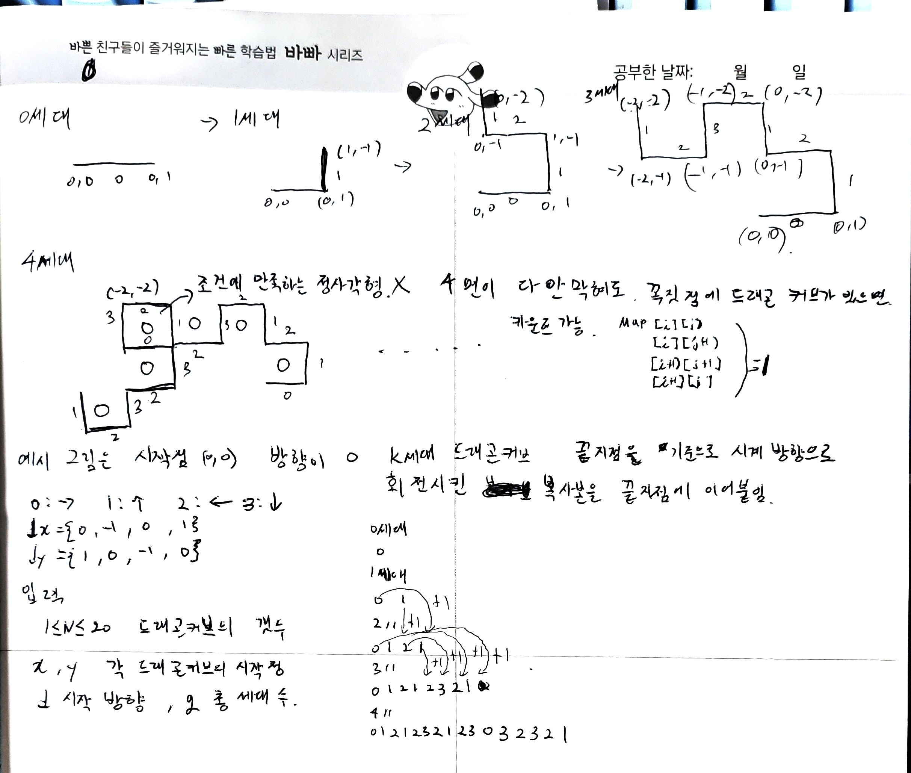
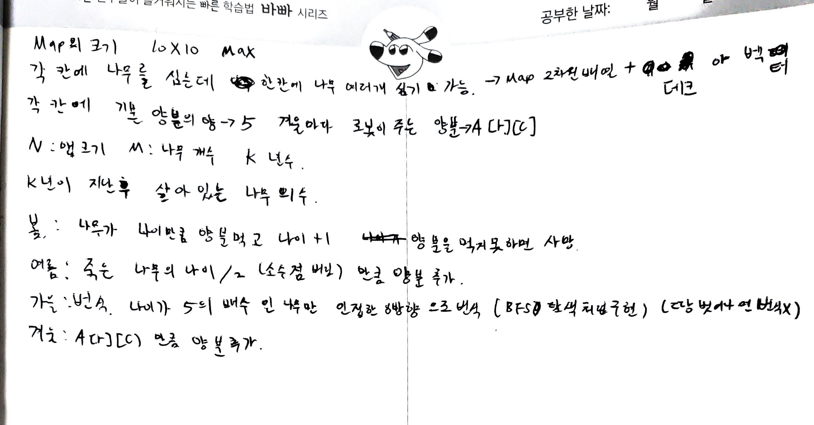

<h1 align = "center">백준 15685번 드래곤커브</h1>

### [문제 링크](https://www.acmicpc.net/problem/15685 "")
---

### 최초 코드

```cpp
//이전세대를 역순으로 조사하면서 방향정보를 1씩 더해주고 뒤에 붙이면 다음 세대가 나옴
//격자 크기는 x,y 범위 생각해봤을때 최소 100X100 
//드래곤커브는 격자를 벗어날 수 없음
#include<iostream>
#include<vector>
#include<cstring>
using namespace std;

int N,x,y,d,g;

int Map[110][110];
int dx[]{ 0,-1,0,1 };
int dy[]{ 1,0,-1,0 };

vector<int> dir;

int main(void) {
	cin.tie(NULL)->sync_with_stdio(false);

	cin >> N;

	for (auto i = 0; i < N; ++i) {
		dir.clear();
		cin >> x >> y >> d >> g;
		dir.push_back(d);

		Map[x][y] = 1;
		x += dx[d];
		y += dy[d];
		Map[x][y] = 1;

		for (auto j = 0; j < g; ++g) {
			for (int s = dir.size()-1; s >= 0; --s) {
				int tmp_dir = (dir[s] + 1) % 4;
				x += dx[tmp_dir];
				y += dy[tmp_dir];
				Map[x][y] = 1;
				dir.push_back(tmp_dir);
			}
		}
	}

	int cnt = 0;
	for (auto i = 0; i < 110; ++i) {
		for (auto j = 0; j < 110; ++j) {
			if (Map[i][j] == 1 && Map[i + 1][j] == 1 && Map[i + 1][j + 1] == 1 && Map[i][j + 1] == 1)
				cnt++;
		}
	}

	cout << cnt;

	return 0;
}
```

### 복기


이문제는 솔직히 문제를 읽을때만해도 이해도 잘 안됐고 어떻게 풀어야할지 갈피도 안잡혔는데 예시에따라서 그림도 그려보고 방향을 적어보니까 규칙이 보였다. 


### 최종 코드
```cpp
//이전세대를 역순으로 조사하면서 방향정보를 1씩 더해주고 뒤에 붙이면 다음 세대가 나옴
//격자 크기는 x,y 범위 생각해봤을때 최소 100X100 
//드래곤커브는 격자를 벗어날 수 없음
#include<iostream>
#include<vector>
#include<cstring>
using namespace std;
int N,x,y,d,g;

int Map[110][110];
int dx[]{ 0,-1,0,1 };
int dy[]{ 1,0,-1,0 };

vector<int> dir;

int main(void) {
	cin.tie(NULL)->sync_with_stdio(false);

	cin >> N;

	for (auto i = 0; i < N; ++i) {
		dir.clear();
		cin >> y >> x >> d >> g;
		dir.push_back(d);

		Map[x][y] = 1;
		x += dx[d];
		y += dy[d];
		Map[x][y] = 1;

		for (auto j = 0; j < g; ++j) {
			int num = dir.size();
			for (auto s = num-1; s >= 0; --s) {
				int tmp_dir = (dir[s] + 1) % 4;
				x += dx[tmp_dir];
				y += dy[tmp_dir];
				Map[x][y] = 1;
				dir.push_back(tmp_dir);
			}
		}
	}

	int cnt = 0;
	for (auto i = 0; i < 110; ++i) {
		for (auto j = 0; j < 110; ++j) {
			if (Map[i][j] == 1 && Map[i + 1][j] == 1 && Map[i + 1][j + 1] == 1 && Map[i][j + 1] == 1)
				cnt++;
		}
	}

	cout << cnt;

	return 0;
}
```


<h1 align = "center">백준 16235번 나무제태크</h1>

### [문제 링크](https://www.acmicpc.net/problem/16235 "")
---

### 최초 코드

```cpp
//1 <= N <= 10 인지

#include<iostream>
#include<algorithm>
#include<vector>
using namespace std;

int N, M, K;
int Food[11][11];
int Extra[11][11];
vector<int> Map[11][11];
int dx[]{ -1, -1, 0, 1, 1, 1, 0, -1 };
int dy[]{ 0, 1, 1, 1, 0, -1, -1, -1 };


int main(void) {
	cin.tie(NULL)->sync_with_stdio(false);

	cin >> N >> M >> K;
	for (auto i = 1; i <= N; ++i) {
		for (auto j = 1; j <= N; ++j) {
			cin >> Extra[i][j];//로봇이 뿌릴 양분의 양
			Food[i][j] = 5;//기본적으로 5씩 넣고 시작
		}
	}

	for (auto i = 0; i < M; ++i) {
		int x, y, z;
		cin >> x >> y >> z;
		Map[x][y].push_back(z);//나무추가
	}
	//나무가 성장하거나 / 죽으면서 양분 추가
	for (auto h = 0; h < K; ++h) {
		for (auto i = 1; i <= N; ++i) {
			for (auto j = 1; j <= N; ++j) {
				if (Map[i][j].size() == 0)continue;//나무가없으면 지나가기

				sort(Map[i][j].begin(), Map[i][j].end());//나이순으로 정렬해주기

				int tmpfood = 0;
				vector<int> tmptree;
				for (auto k = 0; k < Map[i][j].size(); ++k) {
					/*if (Food[i][j] >= Map[i][j][k]) {
						Food[i][j] -= Map[i][j][k];
						Map[i][j][k]++;
					}
					else
						Map[i][j].erase(Map[j][j].begin()+k)
						tmpfood += (Map[i][j][k] / 2);
						죽으면 삭제하면서 가려고했는데 k에도 영향을 주고 벡터의 크기도 달라져서 제대로 작동 안함
						-> 새로운 벡터에 넣어놓고 원래꺼 비운다음에 추가하는방법으로...
					*/
					if (Food[i][j] >= Map[i][j][k]) {
						Food[i][j] -= Map[i][j][k];
						tmptree.push_back(Map[i][j][k] + 1);
					}
					else
						tmpfood += (Map[i][j][k] / 2);
				}
				Food[i][j] += tmpfood;
				Map[i][j].clear();
				for (auto k = 0; k < tmptree.size(); ++k) {
					Map[i][j].push_back(tmptree[k]);
				}
			}
		}

		//나무 번식하기
		for (auto i = 1; i <= N; ++i) {
			for (auto j = 1; j <= N; ++j) {
				int size = Map[i][j].size();
				if (size == 0)continue;

				for (auto k = 0; k < size; ++k) {
					int age = Map[i][j][k];

					if (age % 5 == 0) {//나이가 5의 배수여야지만 번식가능
						for (auto d = 0; d < 8; ++d) {
							int nx = i + dx[d];
							int ny = j + dy[d];

							if (nx<1 || nx>N || ny<1 || ny>N) continue;

							Map[nx][ny].push_back(1);//1살짜리 응애나무 추가
						}
					}
				}
			}
		}

		for (auto i = 1; i <= N; ++i) {
			for (auto j = 1; j <= M; ++j) {
				Food[i][j] += Extra[i][j];
			}
		}
	}

	int result = 0;
	for (auto i = 1; i <= N; ++i) {
		for (auto j = 1; j <= M; ++j) {
			result += Map[i][j].size();
		}
	}

	cout << result;

	return 0;
}
```

### 복기

### 최종 코드
```cpp

```