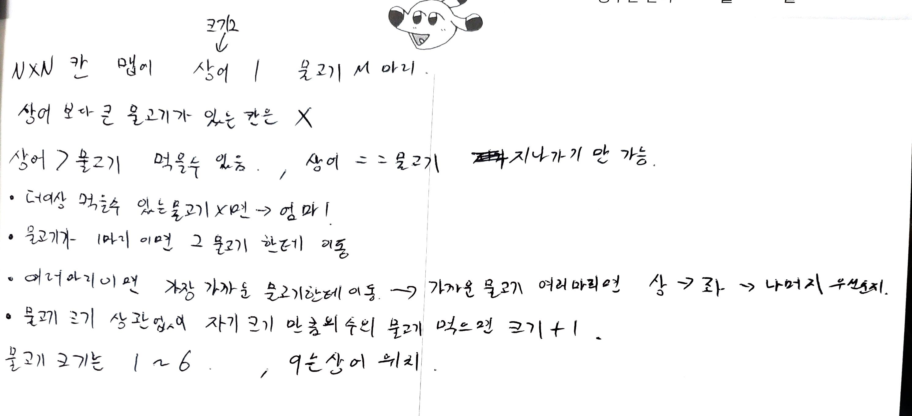

<h1 align = "center">백준 17140번 이차원배열의 연산</h1>

### [문제 링크](https://www.acmicpc.net/problem/17140 "")
---

### 최초 코드

```cpp
//R,C,K<100이므로 MAX101로

#include<iostream>
#include<vector>
#include<algorithm>
#include<cstring>
using namespace std;

int R, C, K, result;
const int MAX = 101;
int Map[MAX][MAX];
int check[MAX];


int main(void) {
	cin.tie(NULL)->sync_with_stdio(false);

	cin >> R >> C >> K;
	for (auto i = 1; i <= 3; ++i) {
		for (auto j = 1; j <= 3; ++j) {
			cin >> Map[i][j];
		}
	}

	if (Map[R][C] == K) {
		cout << result<<'\n';
		return 0;
	}

	int time = 0;//초기엔 0초 3X3배열
	int x = 3, y = 3;

	while (1) {
		if (Map[R][C] == K) {
			result = time;
			break;
		}

		if (time > 100) {
			result = -1;
			break;
		}
		vector<int> Sizeofxy;//행이나 열 중에 제일 긴 요소에 맞춰야하기때문에 사이즈들을 저장할 벡터
		if (x >= y) {//행이 열보다 크기가 크거나 같으면
			for (auto i = 1; i <= x; ++i) {
				vector<pair<int, int>> v;
				memset(check, 0, sizeof(check));

				for (auto j = 1; j <= y; ++j)check[Map[i][j]]++;
				for (auto j = 1; j < MAX; ++j) {
					if (check[j] == 0)continue;
					v.push_back({ check[j],j });
				}

				sort(v.begin(), v.end());
				int num = 1;
				for (auto& tmp : v) {
					Map[i][num++] = tmp.second;
					Map[i][num++] = tmp.first;
				}
				num--;
				Sizeofxy.push_back(num);
			}
			sort(Sizeofxy.begin(), Sizeofxy.end());
			y = Sizeofxy.back();
		}
		else {//반대로 열이 행보다 크면
			for (auto i = 1; i <= y; ++i) {
				vector<pair<int, int>> v;
				memset(check, 0, sizeof(check));

				for (auto j = 1; j <= x; ++j)check[Map[i][j]]++;
				for (auto j = 1; j < MAX; ++j) {
					if (check[j] == 0)continue;
					v.push_back({ check[j],j });
				}

				sort(v.begin(), v.end());
				int num = 1;
				for (auto& tmp : v) {
					Map[i][num++] = tmp.second;
					Map[i][num++] = tmp.first;
				}
				num--;
				Sizeofxy.push_back(num);
			}
			sort(Sizeofxy.begin(), Sizeofxy.end());
			y = Sizeofxy.back();
		}
		time++;
	}

	cout << result << '\n';

	return 0;
}
```

### 복기

이문제는 처음에 문제만보고는 좀 이해가 안갔다. 예시의 설명이 없었으면 한참 헤맸을 문제이다. 처음에는 원래 있던 행에서 갯수를 카운팅해서 넣는 과정에서 원래있던 배열의 요소를 지우고 덮어 씌우는 방법을 사용해야 원래값이 안남는데, 그 과정을 빼먹어서 333이 330이 아닌 333 으로 남아있는 오류가 있었다 그부분과 열 연산에서 좌표값 넣는부분을 수정해주니 맞출수 있었다.
### 최종 코드
```cpp
//R,C,K<100이므로 MAX101로

#include<iostream>
#include<vector>
#include<algorithm>
#include<cstring>
using namespace std;

int R, C, K, result;
const int MAX = 101;
int Map[MAX][MAX];
int check[MAX];


int main(void) {
	cin.tie(NULL)->sync_with_stdio(false);

	cin >> R >> C >> K;
	for (auto i = 1; i <= 3; ++i) {
		for (auto j = 1; j <= 3; ++j) {
			cin >> Map[i][j];
		}
	}

	if (Map[R][C] == K) {
		cout << result<<'\n';
		return 0;
	}

	int time = 0;//초기엔 0초 3X3배열
	int x = 3, y = 3;

	while (1) {
		if (Map[R][C] == K) {
			result = time;
			break;
		}

		if (time > 100) {
			result = -1;
			break;
		}
		vector<int> Sizeofxy;//행이나 열 중에 제일 긴 요소에 맞춰야하기때문에 사이즈들을 저장할 벡터
		if (x >= y) {//행이 열보다 크기가 크거나 같으면
			for (auto i = 1; i <= x; ++i) {
				vector<pair<int, int>> v;
				memset(check, 0, sizeof(check));

				for (auto j = 1; j <= y; ++j)check[Map[i][j]]++;
				for (auto j = 1; j < MAX; ++j) {
					if (check[j] == 0)continue;
					v.push_back({ check[j],j });
				}

				sort(v.begin(), v.end());
				for (auto j = 1; j <= y; ++j) Map[i][j] = 0;
				int num = 1;


				for (auto& tmp : v) {
					Map[i][num++] = tmp.second;
					Map[i][num++] = tmp.first;
				}
				num--;

				Sizeofxy.push_back(num);
			}
			sort(Sizeofxy.begin(), Sizeofxy.end());
			y = Sizeofxy.back();
		}
		else {//반대로 열이 행보다 크면
			for (auto i = 1; i <= y; ++i) {
				vector<pair<int, int>> v;
				memset(check, 0, sizeof(check));

				for (auto j = 1; j <= x; ++j)check[Map[j][i]]++;
				for (auto j = 1; j < MAX; ++j) {
					if (check[j] == 0)continue;
					v.push_back({ check[j],j });
				}

				sort(v.begin(), v.end());
				for (auto j = 1; j <= y; ++j)Map[j][i] = 0;
				int num = 1;


				for (auto& tmp : v) {
					Map[num++][i] = tmp.second;
					Map[num++][i] = tmp.first;
				}
				num--;
				Sizeofxy.push_back(num);
			}
			sort(Sizeofxy.begin(), Sizeofxy.end());
			x = Sizeofxy.back();
		}
		time++;
	}

	cout << result << '\n';

	return 0;
}
```

<h1 align = "center">백준 14442번 벽 부수고 이동하기2</h1>

### [문제 링크](https://www.acmicpc.net/problem/14442 "14442번 벽 부수고 이동하기2")
---

### 최초 코드(실패:시간초과 24%)

```cpp
//최단거리 구하기BFS +벽 부수기..
// 벽을 부순다...

#include<iostream>
#include<queue>
using namespace std;

int dx[] = { 1,0,-1,0 };
int dy[] = { 0,-1,0,1 };
int N, M,K, result = 0;//N세로 M가로
int Map[1001][1001] = { 0, };
int vis[1001][1001][11] = { 0, }; // 0~10개까지 부술 수 있으므로 
queue<pair<pair<int, int>, pair<int,int>>> q;

void BFS() {
	bool breakable = 0;
	q.push({ { 0,0 }, {0,1} });
	vis[0][0][0] = 1;

	while (!q.empty()) {
		auto [x, y] = q.front().first;
		auto [k, c] = q.front().second;
		q.pop();

		if (x == N - 1 && y == M - 1) {//끝지점 도착하면
			result = c;
			return;
		}

		for (auto i = 0; i < 4; ++i) {
			int nx = x + dx[i];
			int ny = y + dy[i];

			if (nx < 0 || nx >= N || ny < 0 || ny >= M) continue;
			if (vis[nx][ny][k] == 0) {
				if (Map[nx][ny] == 1 && k < K) {//다음칸이 벽인데 부술 수 있으면
					q.push({ { nx,ny }, {k + 1,c + 1} });
					vis[nx][ny][k + 1] = 1;
				}

				if (Map[nx][ny] == 0) {//다음칸이 0이고 안지나갔으면
					q.push({ {nx,ny},{k,c + 1} });
					vis[nx][ny][k] = 1;
				}

			}
			
		}
	}

	result = -1;
}

int main(void) {
	cin.tie(NULL)->sync_with_stdio(false);

	cin >> N >> M >> K;
	for (auto i = 0; i < N; ++i) {
		string tmp;
		cin >> tmp;
		for (auto j = 0; j < tmp.size(); ++j) {
			//문자열로 되어있기때문에 숫자로 바꿔주기
			Map[i][j] = tmp[j] - '0';
		}
	}

	BFS();
	cout << result;
}
```

### 복기
이문제는 벽 부수고 이동하기문제의 다음단계인데 벽 부수고 이동하기1에서는 벽을 1번만 부술수 있었다면, 이 문제는 최대 K번까지 부술 수 있는 문제였다. 그래서 기존에 벽 부수고 이동하기1을 풀었던 부순 횟수를 카운팅하는 부분을 추가해 K를 넘으면 더이상 카운팅 하지않는 방식으로 구현했는데 계속 시간초과가 나서 통과를 하지 않는다..
### 최종 코드
```cpp

```

<h1 align = "center">백준 16236번 아기상어</h1>

### [문제 링크](https://www.acmicpc.net/problem/16236 "16236번 아기상어")
---

### 최초 코드

```cpp
//0: 빈 칸
//1, 2, 3, 4, 5, 6: 칸에 있는 물고기의 크기
//9 : 아기 상어의 위치

#include<iostream>
#include<queue>
#include<algorithm>
#include<cstring>
#include<vector>
using namespace std;

int N,result;
int Map[21][21];
int vis[21][21];
int dx[] = { 0, -1,1, 0}; // 상좌우하
int dy[] = {-1, 0,0, 1};
bool Caneat = 0;
bool ate = 0;

struct Shark {
	int x, y;
	int size;
	int cnt;//먹을때마다 카운트 1씩 증가시켜서 size랑 같아지면 크기 up
};
Shark shark;

void BFS() {
	queue<pair<pair<int, int>, int>> q;
	q.push({{ shark.x,shark.y }, 0});
	vis[shark.y][shark.x] = 1;
	int tmptime = 0;//먹으러 가는데 걸린시간

	while (!q.empty()) {
		auto [x, y] = q.front().first;
		int cnt = q.front().second;

		//제일 위쪽 먹는거 고려
		if (Map[y][x] > 0 && Map[y][x] < shark.size && tmptime == cnt) {
			if ((shark.y > y) || (shark.y == y && shark.x > x)) {
				shark.x = x;
				shark.y = y;
				continue;
			}
		}
		q.pop();

		for (auto i = 0; i < 4; ++i) {
			int nx = x + dx[i];
			int ny = y + dy[i];

			if (nx < 0 || nx >= N || ny < 0 || ny >= N)continue;
			if (vis[ny][nx])continue;
			if (Map[ny][nx] <= shark.size) {
				if (Map[ny][nx] > 0 && Map[ny][nx] < shark.size && !ate) {
					ate = 1;
					shark.x = nx;
					shark.y = ny;
					tmptime = cnt + 1;
					result += tmptime;
				}
				else {
					q.push({ {nx,ny},cnt + 1 });
					vis[ny][nx] = 1;
				}
			}
		}
	}
}

int main(void) {
	cin.tie(NULL)->sync_with_stdio(false);

	cin >> N;

	for (auto i = 0; i < N; ++i) {
		for (auto j = 0; j < N; ++j) {
			cin >> Map[i][j];
			if (Map[i][j] == 9) {
				shark.x = j;
				shark.y = i;
				shark.size = 2;
				shark.cnt = 0;
				Map[i][j] = 0;
			}
		}
	}
	while (!Caneat) {
		memset(vis, 0, sizeof(vis));
		BFS();
		if (ate) {
			ate = 0;//다시 안먹은상태로
			shark.cnt += 1;
			Map[shark.y][shark.x] = 0;//먹은 물고기 없애주기

			if (shark.cnt == shark.size) {
				shark.size += 1;
				shark.cnt += 0;
			}
		}
		else
			Caneat = 1;
	}

	cout << result<<'\n';
	return 0;
}
```

### 복기


아기상어가 BFS를 통해 물고기를 찾아 먹을수 있으면 먹고 못먹으면 엄마를 호출하는 문제... cnt를 올려 사이즈와 같으면 사이즈를 키우고 카운트를 다시 0으로 만드는 부분에서 cnt=0; 으로 넣어야하는데 cnt+=0;으로 넣는 바람에 제대로 돌아가지 않았다. 이 부분을 고쳐주니 해결이 되었다.
### 최종 코드
```cpp
//0: 빈 칸
//1, 2, 3, 4, 5, 6: 칸에 있는 물고기의 크기
//9 : 아기 상어의 위치

#include<iostream>
#include<queue>
#include<algorithm>
#include<cstring>
#include<vector>
using namespace std;

int N,result;
int Map[21][21];
int vis[21][21];
int dx[] = { -1, 0,0, 1}; // 상좌우하
int dy[] = {0, -1,1, 0};
bool Caneat = 1;
bool ate = 0;

struct Shark {
	int x, y;
	int size;
	int cnt;//먹을때마다 카운트 1씩 증가시켜서 size랑 같아지면 크기 up
};
Shark shark;

void BFS() {
	queue<pair<pair<int, int>, int>> q;
	q.push({{ shark.x,shark.y }, 0});
	vis[shark.x][shark.y] = 1;
	int tmptime = 0;//먹으러 가는데 걸린시간

	while (!q.empty()) {
		auto [x, y] = q.front().first;
		int cnt = q.front().second;

		//제일 위쪽 먹는거 고려
		if (Map[x][y] > 0 && Map[x][y] < shark.size && tmptime == cnt) {
			if ((shark.x > x) || (shark.x == x && shark.y > y)) {
				shark.x = x;
				shark.y = y;
				continue;
			}
		}
		q.pop();

		for (auto i = 0; i < 4; ++i) {
			int nx = x + dx[i];
			int ny = y + dy[i];

			if (nx < 0 || nx >= N || ny < 0 || ny >= N)continue;
			if (vis[nx][ny])continue;
			if (Map[nx][ny] <= shark.size) {
				if (Map[nx][ny] > 0 && Map[nx][ny] < shark.size && !ate) {
					ate = 1;
					shark.x = nx;
					shark.y = ny;
					tmptime = cnt + 1;
					result += tmptime;
				}
				else {
					q.push({ {nx,ny},cnt + 1 });
					vis[nx][ny] = 1;
				}
			}
		}
	}
}

int main(void) {
	cin.tie(NULL)->sync_with_stdio(false);

	cin >> N;

	for (auto i = 0; i < N; ++i) {
		for (auto j = 0; j < N; ++j) {
			cin >> Map[i][j];
			if (Map[i][j] == 9) {
				shark.x = i;
				shark.y = j;
				shark.size = 2;
				shark.cnt = 0;
				Map[i][j] = 0;
			}
		}
	}
	while (Caneat) {
		memset(vis, 0, sizeof(vis));
		BFS();
		if (ate) {
			ate = 0;//다시 안먹은상태로
			shark.cnt += 1;
			Map[shark.x][shark.y] = 0;//먹은 물고기 없애주기

			if (shark.cnt == shark.size) {
				shark.size += 1;
				shark.cnt = 0;
			}
		}
		else
			Caneat = 0;
	}

	cout << result<<'\n';
	return 0;
}
```