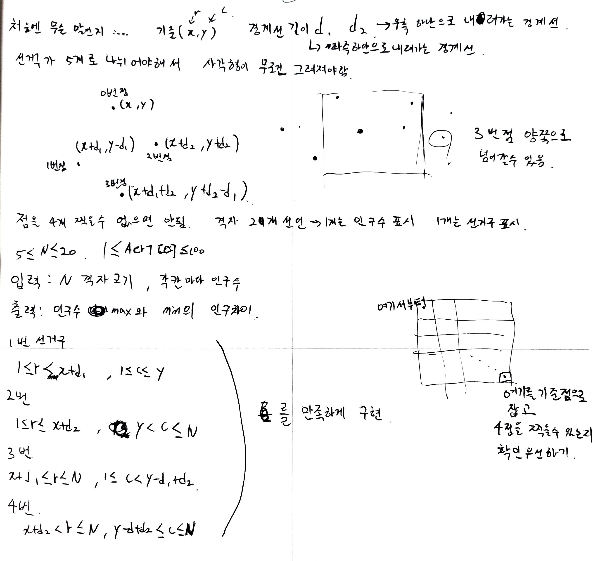

<h1 align = "center">백준 17281번 야구</h1>

### [문제 링크](https://www.acmicpc.net/problem/17281 "17281번 야구")
---

### 최초 코드

```cpp
#include<iostream>
#include<queue>
#include<algorithm>
using namespace std;

int N, result=-100000000;
int baseball[52][9];
int arr[8]{ 1,2,3,4,5,6,7,8 };//순열용 배열 1번선수는 4번타자로 확정이라서 8명만 돌리면 됨

int main(void) {
	cin.tie(NULL)->sync_with_stdio(false);

	cin >> N;

	for (auto i = 0; i < N; ++i) {
		for (auto j = 0; j < 9; ++j) {
			cin >> baseball[i][j];
		}
	}

	do {
		queue<int> Q;
		int ining = 0, score = 0;//1이닝부터 해도 되는데 배열을 0번인덱스 부터 받아서 편의상 0부터

		for (auto i = 0; i < 3; ++i)
			Q.push(arr[i]);
		//4번타자는 무조건 0번 인덱스인 1번선수로
		Q.push(0);
		for (auto i = 3; i < 8; ++i)
			Q.push(arr[i]);

		//정해진 이닝만큼 야구 시뮬레이션 돌리기
		while (ining < N) {
			int outcnt = 0;
			queue<int> base;
			for (auto i = 0; i < 3; ++i)
				base.push(0); //베이스 전부 더미선수로 채워주기

			while (outcnt < 3) {
				int x = Q.front();
				Q.pop();
				Q.push(x);//진루든 아웃이든 제일 뒷순위로 보내기

				if (baseball[ining][x] == 0)//아웃
					outcnt+=1;
				else {
					if (base.front() == 1)score += 1;
					base.push(1);//진루시키고
					base.pop();
					for (auto i = 0; i < baseball[ining][x] - 1; ++i) {//남은 타수만큼 앞으로 보내고 빈공간 더미로 채우기
						if (base.front() == 1)score += 1;
						base.pop();
						base.push(0);
					}
				}
			}
			ining += 1;
		}

		result = max(score, result);


	} while (next_permutation(arr, arr + 8));

	cout << result;

	return 0;
}
```

### 복기


<h1 align = "center">백준 17779번 게리맨더링2</h1>

### [문제 링크](https://www.acmicpc.net/problem/17779 "17779번 게리맨더링2")
---

### 최초 코드

```cpp
#include<iostream>
#include<queue>
#include<vector>
#include<algorithm>
using namespace std;

struct Info {
	int x, y;
};
Info Point[4];//격자에 찍을 점4개

int N, result=10000000;
int Map[21][21];
int section[21][21];

bool checkpoint(int x, int y, int d1, int d2) {//풀이에 그린 그림 토대로 작성
	if (x + d1 >= N || y - d1 < 0)return false;//1번점
	if (x + d2 >= N || y + d2 >= N)return false;//2번점
	if (x + d1 + d2 >= N || y - d1 + d2 < 0)return false;//3번점 왼쪽으로 나가는경우
	if (x + d1 + d2 >= N || y - d1 + d2 >=N)return false;//3번점 오른쪽으로 나가는경우

	return true;// 위에 4개 다 뚫고 만족하면 참
}

void make_section(int x, int y, int d1, int d2) {
	//경계선이 대각선이라서 위에 구역들은 행이 내려가다가 경계선을 만나면 열이 1칸씩 줄어드는것을 고려해야함
	//반대로 아래 구역은 행이 내려갈때마다 열이 증가하다가 경계선을 안만나면 그대로 한줄씩 맵끝까지 채우기
	int sum[6]{ 0, };

	int cntdown = 0;
	for (auto i = 0; i < Point[1].x; ++i) {
		if (i >= Point[0].x) cntdown++;
		for (auto j = 0; j <= Point[0].y - cntdown; ++j) { //c<=y
			section[i][j] = 1;
		}
	}

	cntdown = 0;
	for (auto i = 0; i <= Point[2].x; ++i) {
		if (i > Point[0].x) cntdown++;
		for (auto j = Point[0].y + 1 + cntdown; j < N; ++j) { // y<c
			section[i][j] = 2;
		}
	}

	int cntup = 0;
	for (auto i = N - 1; i >= Point[1].x; --i) {
		if (i < Point[3].x) cntup++;
		for (auto j = 0; j < Point[3].y - cntup; ++j) {
			section[i][j] = 3;
		}
	}

	cntup = 0;
	for (auto i = N - 1; i > Point[2].x; --i) {
		if (i <= Point[3].x)cntup++;
		for (auto j = Point[3].y + cntup; j < N; ++j) {
			section[i][j] = 4;
		}
	}

	for (auto i = 0; i < N; ++i) {
		for (auto j = 0; j < N; ++j) {
			sum[section[i][j]] += Map[i][j];
		}
	}
	sort(sum, sum + 6);
	int tmp = sum[5] - sum[1];
	result = min(result, tmp);
}

int main(void) {
	cin.tie(NULL)->sync_with_stdio(false);

	cin >> N;
	for (auto i = 0; i < N; ++i) {
		for (auto j = 0; j < N; ++j) {
			cin >> Map[i][j];
		}
	}

	//모든점에서 기준을 한번씩 잡고 점을 4개 찍을 수 있으면 ㄱㄱ 
	for (auto i = 0; i < N; ++i) {
		for (auto j = 0; j < N; ++j) {
			for (auto d1 = 1; d1 <= j;++d1) {//d1이 j를 넘으면 점을 못찍음
				for (auto d2 = 1; d2 < N - j; ++d2) {//나머지 방향도 마찬가지
					if (checkpoint(i, j, d1, d2) == 1) {
						//0번점
						Point[0].x = i;
						Point[0].y = j;
						//1번점
						Point[1].x = i+d1;
						Point[1].y = j-d1;
						//2번점
						Point[2].x = i+d2;
						Point[2].y = j+d2;
						//3번점
						Point[3].x = i+d1+d2;
						Point[3].y = j+d2-d1;

						for (auto i = 0; i < N; ++i) {
							for (auto j = 0; j < N; ++j) {
								section[i][j]=5;//전부다 5로 채워주고 나머지를 1~4까지 만들어주기
							}
						}
						make_section(i, j, d1, d2);
					}
				}
			}
		}
	}

	cout << result << '\n';
	return 0;
}
```

### 복기



<h1 align = "center">백준 번 </h1>

### [문제 링크](https://www.acmicpc.net/problem/ "")
---

### 최초 코드

```cpp

```

### 복기

### 최종 코드
```cpp

```