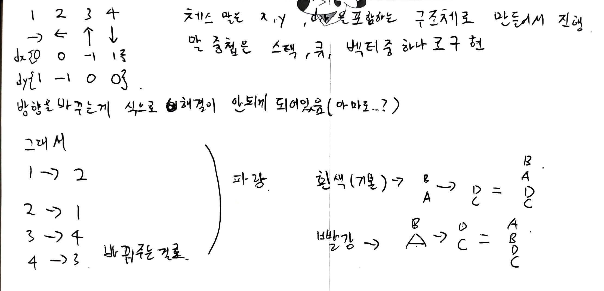

<h1 align = "center">백준 17281번 야구</h1>

### [문제 링크](https://www.acmicpc.net/problem/17281 "17281번 야구")
---

### 최초 코드

```cpp
#include<iostream>
#include<queue>
#include<algorithm>
using namespace std;

int N, result=-100000000;
int baseball[52][9];
int arr[8]{ 1,2,3,4,5,6,7,8 };//순열용 배열 1번선수는 4번타자로 확정이라서 8명만 돌리면 됨

int main(void) {
	cin.tie(NULL)->sync_with_stdio(false);

	cin >> N;

	for (auto i = 0; i < N; ++i) {
		for (auto j = 0; j < 9; ++j) {
			cin >> baseball[i][j];
		}
	}

	do {
		queue<int> Q;
		int ining = 0, score = 0;//1이닝부터 해도 되는데 배열을 0번인덱스 부터 받아서 편의상 0부터

		for (auto i = 0; i < 3; ++i)
			Q.push(arr[i]);
		//4번타자는 무조건 0번 인덱스인 1번선수로
		Q.push(0);
		for (auto i = 3; i < 8; ++i)
			Q.push(arr[i]);

		//정해진 이닝만큼 야구 시뮬레이션 돌리기
		while (ining < N) {
			int outcnt = 0;
			queue<int> base;
			for (auto i = 0; i < 3; ++i)
				base.push(0); //베이스 전부 더미선수로 채워주기

			while (outcnt < 3) {
				int x = Q.front();
				Q.pop();
				Q.push(x);//진루든 아웃이든 제일 뒷순위로 보내기

				if (baseball[ining][x] == 0)//아웃
					outcnt+=1;
				else {
					if (base.front() == 1)score += 1;
					base.push(1);//진루시키고
					base.pop();
					for (auto i = 0; i < baseball[ining][x] - 1; ++i) {//남은 타수만큼 앞으로 보내고 빈공간 더미로 채우기
						if (base.front() == 1)score += 1;
						base.pop();
						base.push(0);
					}
				}
			}
			ining += 1;
		}

		result = max(score, result);


	} while (next_permutation(arr, arr + 8));

	cout << result;

	return 0;
}
```

### 복기


<h1 align = "center">백준 17779번 게리맨더링2</h1>

### [문제 링크](https://www.acmicpc.net/problem/17779 "17779번 게리맨더링2")
---

### 최초 코드

```cpp
#include<iostream>
#include<queue>
#include<vector>
#include<algorithm>
using namespace std;

struct Info {
	int x, y;
};
Info Point[4];//격자에 찍을 점4개

int N, result=10000000;
int Map[21][21];
int section[21][21];

bool checkpoint(int x, int y, int d1, int d2) {//풀이에 그린 그림 토대로 작성
	if (x + d1 >= N || y - d1 < 0)return false;//1번점
	if (x + d2 >= N || y + d2 >= N)return false;//2번점
	if (x + d1 + d2 >= N || y - d1 + d2 < 0)return false;//3번점 왼쪽으로 나가는경우
	if (x + d1 + d2 >= N || y - d1 + d2 >=N)return false;//3번점 오른쪽으로 나가는경우

	return true;// 위에 4개 다 뚫고 만족하면 참
}

void make_section(int x, int y, int d1, int d2) {
	//경계선이 대각선이라서 위에 구역들은 행이 내려가다가 경계선을 만나면 열이 1칸씩 줄어드는것을 고려해야함
	//반대로 아래 구역은 행이 내려갈때마다 열이 증가하다가 경계선을 안만나면 그대로 한줄씩 맵끝까지 채우기
	int sum[6]{ 0, };

	int cntdown = 0;
	for (auto i = 0; i < Point[1].x; ++i) {
		if (i >= Point[0].x) cntdown++;
		for (auto j = 0; j <= Point[0].y - cntdown; ++j) { //c<=y
			section[i][j] = 1;
		}
	}

	cntdown = 0;
	for (auto i = 0; i <= Point[2].x; ++i) {
		if (i > Point[0].x) cntdown++;
		for (auto j = Point[0].y + 1 + cntdown; j < N; ++j) { // y<c
			section[i][j] = 2;
		}
	}

	int cntup = 0;
	for (auto i = N - 1; i >= Point[1].x; --i) {
		if (i < Point[3].x) cntup++;
		for (auto j = 0; j < Point[3].y - cntup; ++j) {
			section[i][j] = 3;
		}
	}

	cntup = 0;
	for (auto i = N - 1; i > Point[2].x; --i) {
		if (i <= Point[3].x)cntup++;
		for (auto j = Point[3].y + cntup; j < N; ++j) {
			section[i][j] = 4;
		}
	}

	for (auto i = 0; i < N; ++i) {
		for (auto j = 0; j < N; ++j) {
			sum[section[i][j]] += Map[i][j];
		}
	}
	sort(sum, sum + 6);
	int tmp = sum[5] - sum[1];
	result = min(result, tmp);
}

int main(void) {
	cin.tie(NULL)->sync_with_stdio(false);

	cin >> N;
	for (auto i = 0; i < N; ++i) {
		for (auto j = 0; j < N; ++j) {
			cin >> Map[i][j];
		}
	}

	//모든점에서 기준을 한번씩 잡고 점을 4개 찍을 수 있으면 ㄱㄱ 
	for (auto i = 0; i < N; ++i) {
		for (auto j = 0; j < N; ++j) {
			for (auto d1 = 1; d1 <= j;++d1) {//d1이 j를 넘으면 점을 못찍음
				for (auto d2 = 1; d2 < N - j; ++d2) {//나머지 방향도 마찬가지
					if (checkpoint(i, j, d1, d2) == 1) {
						//0번점
						Point[0].x = i;
						Point[0].y = j;
						//1번점
						Point[1].x = i+d1;
						Point[1].y = j-d1;
						//2번점
						Point[2].x = i+d2;
						Point[2].y = j+d2;
						//3번점
						Point[3].x = i+d1+d2;
						Point[3].y = j+d2-d1;

						for (auto i = 0; i < N; ++i) {
							for (auto j = 0; j < N; ++j) {
								section[i][j]=5;//전부다 5로 채워주고 나머지를 1~4까지 만들어주기
							}
						}
						make_section(i, j, d1, d2);
					}
				}
			}
		}
	}

	cout << result << '\n';
	return 0;
}
```

### 복기


<h1 align = "center">백준 17837번 새로운게임2</h1>

### [문제 링크](https://www.acmicpc.net/problem/17837 "17837번 새로운게임2")
---

### 최초 코드(실패: 메모리 초과)

```cpp
//게임이 종료되는 턴의 번호를 출력한다. 그 값이 1,000보다 크거나 절대로 게임이 종료되지 않는 경우에는 -1을 출력한다.

#include<iostream>
#include<vector>
#include<cstring>
#include<queue>
using namespace std;

int N, K;
struct Chess {
	int x, y, dir;
};
int Map[13][13];
vector<int> chessMap[14][14];
Chess chess[11];

int dx[]{ 0,0,0,-1,1 };
int dy[]{ 0,1,-1,0,0 };

int reversedir(int dir) {
	if (dir == 1) return 2;
	else if (dir == 2) return 1;
	else if (dir == 3) return 4;
	else if (dir == 4) return 3;
}

void Move(int x,int y,int dir,int pos, int state) {
	int nx = x + dx[dir];
	int ny = y + dy[dir];

	if (state == 0) {//흰 블록 -> 여기도 마찬가지로 자신이 중간에 껴있을 수도 있기때문에 자신이 몇번째에 있는지 인덱스 확인 필요함


		//for (auto& v : chessMap[x][y]) {
		//	chessMap[nx][ny].push_back(v);
		//}
		int count = 0;
		for (auto i = pos; i < chessMap[x][y].size(); ++i) {
			chessMap[nx][ny].push_back(chessMap[x][y][i]);
			chess[chessMap[x][y][i]].x = nx;
			chess[chessMap[x][y][i]].y = ny;
			count += 1;
		}
		for (auto i = 0; i < count; ++i)
			chessMap[x][y].pop_back();
	}
	else if (state == 1) {//빨간블록 -> 전체를 뒤집는다 생각했는데 자신보다 위에 있는 말까지만 뒤집는거임 그러므로 자기자신이 몇번째 인덱스인지 확인 필요
		int count = 0;
		for (auto i = chessMap[x][y].size()-1; pos >= i; i) {//뒤집어주기
			chessMap[nx][ny].push_back(chessMap[x][y][i]);
			chess[chessMap[x][y][i]].x = nx;
			chess[chessMap[x][y][i]].y = ny;
			count += 1;
		}
		for (auto i = 0; i < count; ++i)
			chessMap[x][y].pop_back();
	}
	else if (state == 2) {//파란블록, 벽으로 나갔을때
		int Dir = reversedir(dir);
		chess[chessMap[x][y][pos]].dir = Dir;

		int nnx = x + dx[Dir];
		int nny = y + dy[Dir];
		//방향은 우선 바꿔주고
		//움직일수 있는 조건에서만 한번 움직여주기

		if (nnx >= 0 && nnx < N && nny >= 0 && nny < N) {//continue가 안되니까 만족할때로
			if (Map[nnx][nny] != 2)
				Move(x, y, Dir, pos, Map[nnx][nny]);
		}
	}
}

int main(void) {
	cin.tie(NULL)->sync_with_stdio(false);
	int time = 0,pos=0;
	bool check = false;

	cin >> N >> K;

	for (auto i = 0; i < N; ++i) {
		for (auto j = 0; j < N; ++j) {
			cin >> Map[i][j];
		}
	}

	//다음 K개의 줄에 말의 정보가 1번 말부터 순서대로 주어진다. 확인
	for (auto k = 0; k < K; ++k) {
		int a, b, c;
		cin >> a >> b >> c;
		chess[k] = { a - 1,b - 1,c };
		chessMap[a - 1][b - 1].push_back(k);
	}

	while (1) {
		if (time > 1000) break;
		for (auto k = 0; k < K; ++k) {
			auto& [x, y, dir] = chess[k];
			for (int d = 0; d < chessMap[x][y].size(); ++d) {
				if (chessMap[x][y][d] == k)pos = d;
			}

			int nx = x + dx[dir];
			int ny = y + dy[dir];
			if (nx < 0 || nx >= N || ny < 0 || ny >= N) {//벗어나면 안움직이는게 아닌 파란칸과 동일하게 방향 반대로 바꿔주기
				Move(x, y, dir,pos, 2);
			}
			else {
				Move(x, y, dir,pos, Map[nx][ny]);
			}


			for (auto idx = 0; idx < K; ++idx) {
				int r = chess[idx].x;
				int c = chess[idx].y;
				if (chessMap[r][c].size() >= 4)
					check = true;
 			}
			
		}

		if (check == true)
			break;
		time++;
	}

	if (check == true)
		cout << time + 1 << '\n';
	else
		cout << -1 << '\n';

	return 0;
}
```

### 복기


> 첫번째 시도 메모리 초과 -> 실패
> 이유는 for (auto i = chessMap[x][y].size()-1; pos >= i; i)
> 빨간블록 부분에서 뒤부터 탐색을 하는데 for문 증감식에서 --i를 해주지 않아서 틀렸다.
### 최종 코드
```cpp

```